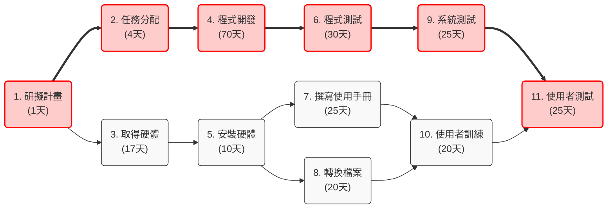
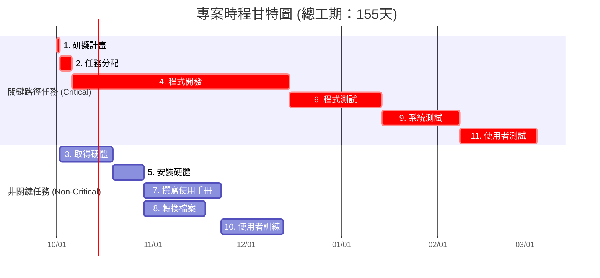

# 作業二：專案時程管理與關鍵路徑分析

根據圖 3-27 之工作分解結構（WBS）清單，針對 11 項任務進行任務模式設定、時間推算、PERT/CPM 網路圖繪製、甘特圖繪製與關鍵路徑分析。

---

## 步驟 (1) 與 (2)：任務清單、任務模式與起訖時間

* **任務模式說明**：全數設定為「自動排程」（Auto Scheduled），並依據前置任務進行鏈結推算。
* **時間說明**：假設專案於 Day 1（2026/10/01）正式啟動。

| 任務編號 | 任務說明 | 需時 (天) | 前置任務 | 任務模式 | 開始時間 | 結束時間 |
| :---: | :--- | :---: | :---: | :---: | :---: | :---: |
| **1** | 研擬計畫 | 1 | - | 自動排程 | Day 1 (10/01) | Day 1 (10/01) |
| **2** | 任務分配 | 4 | 1 | 自動排程 | Day 2 (10/02) | Day 5 (10/05) |
| **3** | 取得硬體 | 17 | 1 | 自動排程 | Day 2 (10/02) | Day 18 (10/18) |
| **4** | 程式開發 | 70 | 2 | 自動排程 | Day 6 (10/06) | Day 75 (12/14) |
| **5** | 安裝硬體 | 10 | 3 | 自動排程 | Day 19 (10/19) | Day 28 (10/28) |
| **6** | 程式測試 | 30 | 4 | 自動排程 | Day 76 (12/15) | Day 105 (01/13) |
| **7** | 撰寫使用手冊 | 25 | 5 | 自動排程 | Day 29 (10/29) | Day 53 (11/22) |
| **8** | 轉換檔案 | 20 | 5 | 自動排程 | Day 29 (10/29) | Day 48 (11/17) |
| **9** | 系統測試 | 25 | 6 | 自動排程 | Day 106 (01/14) | Day 130 (02/07) |
| **10** | 使用者訓練 | 20 | 7, 8 | 自動排程 | Day 54 (11/23) | Day 73 (12/12) |
| **11** | 使用者測試 | 25 | 9, 10 | 自動排程 | Day 131 (02/08) | Day 155 (03/04) |

---

## (1) PERT / CPM 圖 (網絡圖)

> 註：圖中紅色框線與粗箭號代表 **關鍵路徑 (Critical Path)**。

---

## (2) 甘特圖 (Gantt Chart)

---

## (3) 關鍵路徑 (Critical Path) 與分析

1. **專案所有可能路徑與總工期：**
   * **路徑 A（系統軟體線）：** $1 \rightarrow 2 \rightarrow 4 \rightarrow 6 \rightarrow 9 \rightarrow 11 = 1 + 4 + 70 + 30 + 25 + 25 = \mathbf{155\text{ 天}}$
   * **路徑 B（硬體與手冊線）：** $1 \rightarrow 3 \rightarrow 5 \rightarrow 7 \rightarrow 10 \rightarrow 11 = 1 + 17 + 10 + 25 + 20 + 25 = \mathbf{98\text{ 天}}$
   * **路徑 C（硬體與檔案轉換線）：** $1 \rightarrow 3 \rightarrow 5 \rightarrow 8 \rightarrow 10 \rightarrow 11 = 1 + 17 + 10 + 20 + 20 + 25 = \mathbf{93\text{ 天}}$

2. **關鍵路徑判定：**
   * **關鍵路徑為：** **1 → 2 → 4 → 6 → 9 → 11**
   * **專案總工期：** **155 天**

3. **結論與說明：**
   * 由於「程式開發 (70天)」與「程式測試 (30天)」耗時極長，是決定專案能否如期完工的關鍵，此路徑上的任何延誤都會直接導致整個專案延後。
   * 硬體與使用者訓練相關路線（任務 3、5、7、8、10）具有較充裕的寬限時間（Float Time），只要在 Day 130 以前完成「使用者訓練」，就不會影響最後「使用者測試」的開工。
